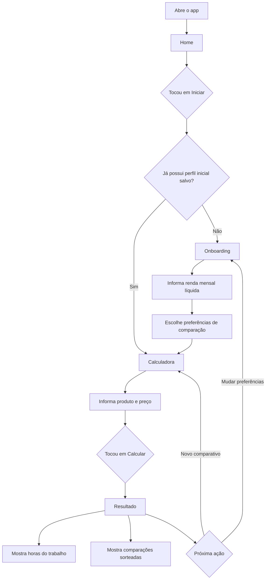
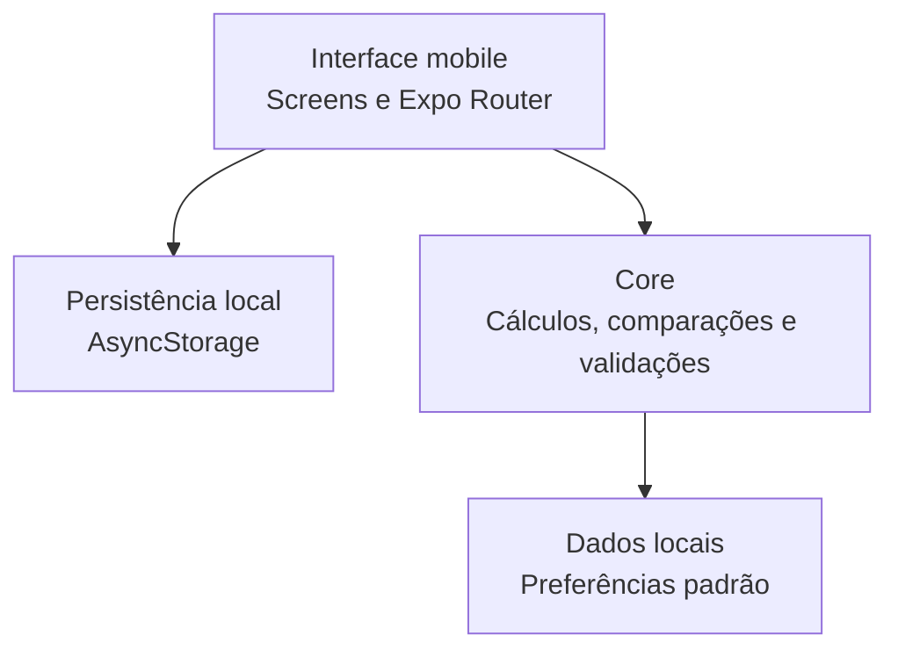
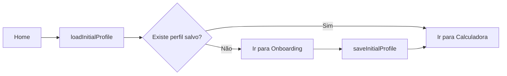

# Fluxogramas

Este documento usa Mermaid para representar o fluxo atual da aplicação e as camadas principais.

## Fluxo do Usuário

```mermaid
flowchart TD
  A[Abre o app] --> B[Home]
  B --> C{Tocou em Iniciar}
  C --> D{Já possui perfil inicial salvo?}
  D -- Não --> E[Onboarding]
  D -- Sim --> H[Calculadora]
  E --> F[Informa renda mensal líquida]
  F --> G[Escolhe preferências de comparação]
  G --> H
  H --> I[Informa produto e preço]
  I --> J{Tocou em Calcular}
  J --> K[Resultado]
  K --> L[Mostra horas do trabalho]
  K --> M[Mostra comparações sorteadas]
  K --> N{Próxima ação}
  N -- Novo comparativo --> H
  N -- Mudar preferências --> E
```

## Fluxo de Cálculo

```mermaid
flowchart TD
  A[Produto e preço] --> B[Perfil financeiro local]
  B --> C[calculateHourlyRate]
  C --> D[calculateWorkHoursEquivalent]
  D --> E[Horas do trabalho]
  A --> F[Preferências do usuário]
  F --> G[calculateComparisonResults]
  G --> H[Comparações preferidas]
  G --> I[Fallback local quando necessário]
  E --> J[Tela de resultado]
  H --> J
  I --> J
```

## Camadas

```mermaid
flowchart TB
  UI[Interface mobile<br/>Screens e Expo Router]
  Storage[Persistência local<br/>AsyncStorage]
  Core[Core<br/>Cálculos, comparações e validações]
  Data[Dados locais<br/>Preferências padrão]

  UI --> Storage
  UI --> Core
  Core --> Data
```

## Decisão de Primeiro Uso

```mermaid
flowchart LR
  A[Home] --> B[loadInitialProfile]
  B --> C{Existe perfil salvo?}
  C -- Sim --> D[Ir para Calculadora]
  C -- Não --> E[Ir para Onboarding]
  E --> F[saveInitialProfile]
  F --> D
```
