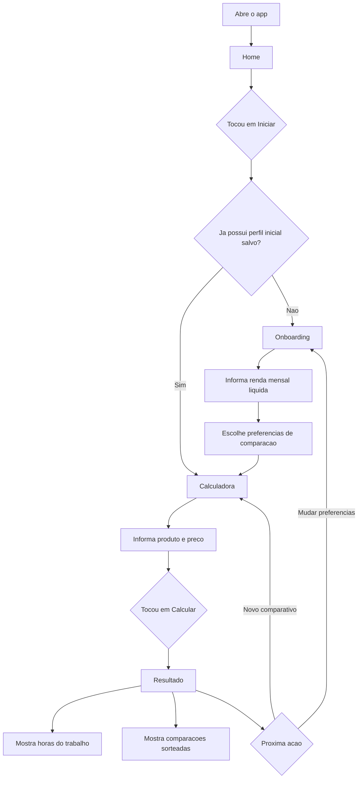
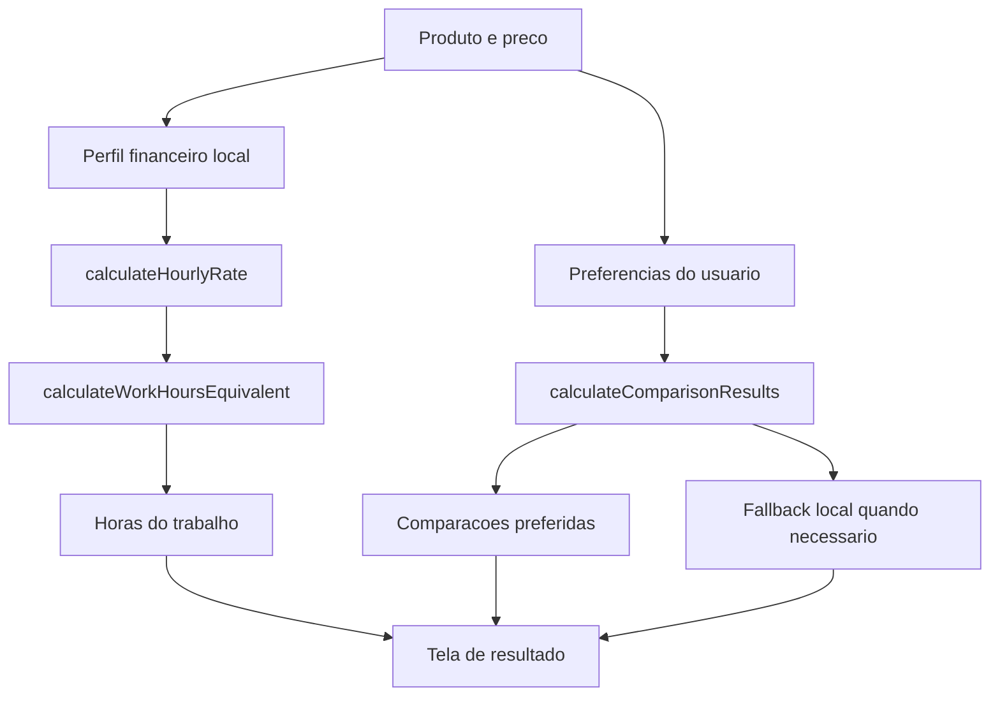
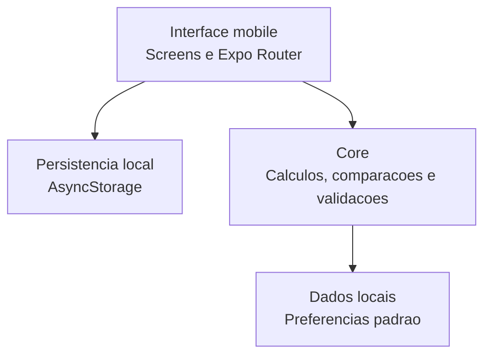

# Fluxogramas

Este documento usa Mermaid para representar o fluxo atual da aplicacao e as camadas principais.

## Fluxo do Usuario

```mermaid
flowchart TD
  A[Abre o app] --> B[Home]
  B --> C{Tocou em Iniciar}
  C --> D{Ja possui perfil inicial salvo?}
  D -- Nao --> E[Onboarding]
  D -- Sim --> H[Calculadora]
  E --> F[Informa renda mensal liquida]
  F --> G[Escolhe preferencias de comparacao]
  G --> H
  H --> I[Informa produto e preco]
  I --> J{Tocou em Calcular}
  J --> K[Resultado]
  K --> L[Mostra horas do trabalho]
  K --> M[Mostra comparacoes sorteadas]
  K --> N{Proxima acao}
  N -- Novo comparativo --> H
  N -- Mudar preferencias --> E
```

## Fluxo de Calculo

```mermaid
flowchart TD
  A[Produto e preco] --> B[Perfil financeiro local]
  B --> C[calculateHourlyRate]
  C --> D[calculateWorkHoursEquivalent]
  D --> E[Horas do trabalho]
  A --> F[Preferencias do usuario]
  F --> G[calculateComparisonResults]
  G --> H[Comparacoes preferidas]
  G --> I[Fallback local quando necessario]
  E --> J[Tela de resultado]
  H --> J
  I --> J
```

## Camadas

```mermaid
flowchart TB
  UI[Interface mobile<br/>Screens e Expo Router]
  Storage[Persistencia local<br/>AsyncStorage]
  Core[Core<br/>Calculos, comparacoes e validacoes]
  Data[Dados locais<br/>Preferencias padrao]

  UI --> Storage
  UI --> Core
  Core --> Data
```

## Decisao de Primeiro Uso

```mermaid
flowchart LR
  A[Home] --> B[loadInitialProfile]
  B --> C{Existe perfil salvo?}
  C -- Sim --> D[Ir para Calculadora]
  C -- Nao --> E[Ir para Onboarding]
  E --> F[saveInitialProfile]
  F --> D
```
